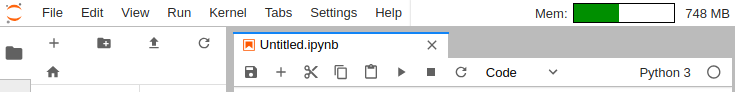

JupyterLab Top Bar
==================

Monorepo to experiment with the top bar space in JupyterLab.

Similar to the [status bar](https://github.com/jupyterlab/jupyterlab/tree/master/packages/statusbar-extension), the top bar can be used to place a few indicators and optimize the overall space.

Inspired by Gnome Shell Top Bar indicators.



## Try it online

Try the extensions in your browser with Binder:

[](https://mybinder.org/v2/gh/jtpio/jupyterlab-topbar/stable?urlpath=lab)

## Installation

Requires JupyterLab 0.35.4

```bash
# container extension
jupyter labextension install jupyterlab-topbar-extension

# system metrics
jupyter labextension install jupyterlab-system-monitor
pip install nbresuse

# custom text in the top bar
jupyter labextension install jupyterlab-topbar-text
```

## Development

```bash
conda env create
conda activate jupyterlab-topbar

./dev-install.sh
```
