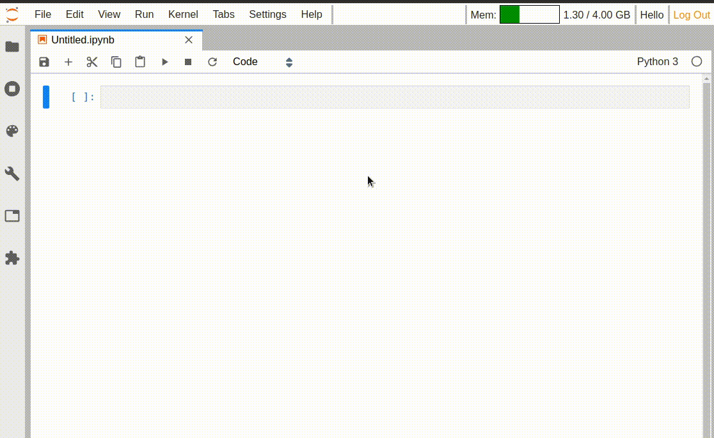

# JupyterLab Top Bar Extensions

[](https://jupyterlab-contrib.github.io/)
[](https://github.com/jupyterlab-contrib/jupyterlab-topbar/actions/workflows/build.yml)
[](https://mybinder.org/v2/gh/jupyterlab-contrib/jupyterlab-topbar/main?urlpath=lab)
[](https://pypi.org/project/jupyterlab-topbar)

Monorepo to experiment with the top bar space in JupyterLab.

Similar to the [status bar](https://github.com/jupyterlab/jupyterlab/tree/master/packages/statusbar-extension), the top bar can be used to place a few indicators and optimize the overall space.

Inspired by Gnome Shell Top Bar indicators.



### Extensions

- [jupyterlab-topbar-text](./packages/topbar-text-extension): add and edit custom text
- [jupyterlab-system-monitor](./packages/system-monitor-extension): show system metrics (memory usage)
- [jupyterlab-logout](./packages/logout-extension): add a "Log Out" button
- [jupyterlab-theme-toggle](./packages/theme-toggler-extension): switch between the Light and Dark themes

## Try it online

Try the extensions in your browser with Binder:

[](https://mybinder.org/v2/gh/jupyterlab-contrib/jupyterlab-topbar/main?urlpath=lab)

## Installation

### JupyterLab 4.x

Use latest versions of the extensions. **Note** that `jupyterlab-system-monitor`
extension will be distributed along with `jupyter-resource-usage` package for
JupyterLab 4.x

```bash
# topbar text extension
pip install jupyterlab-topbar-text

# logout extension
pip install jupyterlab-logout

# theme toggler extension
pip install jupyterlab-theme-toggler
```

### JupyterLab 3.0

Use pinned versions as the latest version is incompatible with JupyterLab 3.x

```bash
# topbar text extension
pip install jupyterlab-topbar-text==0.6.2

# system monitor extension
pip install jupyterlab-system-monitor==0.8.0

# logout extension
pip install jupyterlab-logout==0.5.0

# theme toggler extension. Install it as labextension
jupyter labextension install jupyterlab-topbar-extension jupyterlab-theme-toggle
```

### JupyterLab 1.x and 2.x

```bash
# container extension
jupyter labextension install jupyterlab-topbar-extension

# system metrics
jupyter labextension install jupyterlab-system-monitor
pip install jupyter-resource-usage

# custom text in the top bar
jupyter labextension install jupyterlab-topbar-text

# add a logout button
jupyter labextension install jupyterlab-logout

# theme toggling extension
jupyter labextension install jupyterlab-theme-toggle
```

All-in-one install:

```bash
jupyter labextension install jupyterlab-topbar-extension \
                             jupyterlab-system-monitor \
                             jupyterlab-topbar-text \
                             jupyterlab-logout \
                             jupyterlab-theme-toggle
```

## Development

Note: You will need NodeJS to build the extension package.

The `jlpm` command is JupyterLab's pinned version of
[yarn](https://yarnpkg.com/) that is installed with JupyterLab. You may use
`yarn` or `npm` in lieu of `jlpm` below.

```bash
# Clone the repo to your local environment
# Change directory into the package that we want to develop
cd packages/<extension_name>
# Install package in development mode
pip install -e .
# Link your development version of the extension with JupyterLab
jupyter labextension develop . --overwrite
# Rebuild extension Typescript source after making changes
jlpm run build
```

You can watch the source directory and run JupyterLab at the same time in different terminals to watch for changes in the extension's source and automatically rebuild the extension.

```bash
# Watch the source directory in one terminal, automatically rebuilding when needed
jlpm run watch
# Run JupyterLab in another terminal
jupyter lab
```

With the watch command running, every saved change will immediately be built locally and available in your running JupyterLab. Refresh JupyterLab to load the change in your browser (you may need to wait several seconds for the extension to be rebuilt).

By default, the `jlpm run build` command generates the source maps for this extension to make it easier to debug using the browser dev tools. To also generate source maps for the JupyterLab core extensions, you can run the following command:

```bash
jupyter lab build --minimize=False
```

### Uninstall

```bash
pip uninstall jupyterlab_topbar_text jupyterlab_logout jupyterlab_theme_toggler
```
