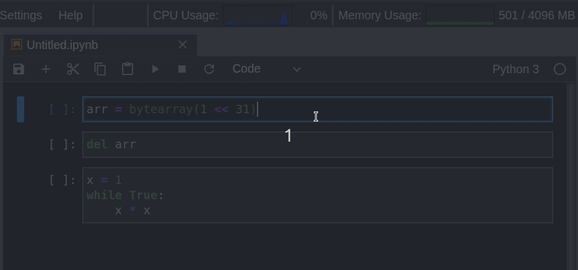
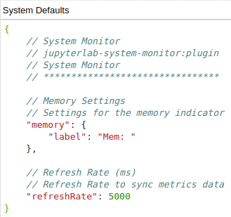

# JupyterLab System Monitor


[](https://mybinder.org/v2/gh/jtpio/jupyterlab-system-monitor/stable?urlpath=lab)
[](https://pypi.org/project/jupyterlab-system-monitor)

JupyterLab extension to display system information (memory and cpu usage).

Provides an alternative frontend for the `jupyter-resource-usage` metrics: [https://github.com/jupyter-server/jupyter-resource-usage](https://github.com/jupyter-server/jupyter-resource-usage)



This extension was originally developed as part of the [jupyterlab-topbar](https://github.com/jtpio/jupyterlab-topbar) project, extracted into its own repository later on and
brought back into the [jupyterlab-topbar](https://github.com/jtpio/jupyterlab-topbar).

## TODO

- Add Network I/O
- Expose more settings

## Prerequisites

- JupyterLab 1.0+
- Node.js

## Installation

This extension requires the `jupyter-resource-usage` package.

**Note: This extension is not compatible with `nbresuse==0.3.4`**.

Starting from JupyterLab 3.0, extensions can be distributed as a Python package. Installation instructions will differ depending on your version of JupyterLab:

### JupyterLab 4.x

Use version `1.0.0`

```bash
pip install jupyterlab-system-monitor==1.0.0
```

### JupyterLab 3.x

Use either version `0.8.0` or `0.7.0`

```bash
pip install jupyterlab-system-monitor<1.0.0
```

### JupyterLab 2.x

```bash
pip install nbresuse
jupyter labextension install jupyterlab-topbar-extension jupyterlab-system-monitor
```

`nbresuse` can also be installed with `conda`:

```bash
conda install -c conda-forge nbresuse
```

Note: Node.js is required to install JupyterLab extensions. It can be installed with `conda`:

```bash
conda install -c conda-forge nodejs
```

## Configuration

### Graphic Display

You can set the memory and cpu limits (but not enforce it) to display the indicator in the top bar.

For more info, check the [memory limit](https://github.com/jupyter-server/jupyter-resource-usage#memory-limit) in the [nbresuse](https://github.com/jupyter-server/jupyter-resource-usage) repository.

Edit `~/.jupyter/jupyter_notebook_config.py` (note: see [here](https://jupyter-notebook.readthedocs.io/en/stable/config.html#config-file-and-command-line-options) if you do not have a config file:

```python
c = get_config()

# memory
c.ResourceUseDisplay.mem_limit = <size_in_GB> *1024*1024*1024

# cpu
c.ResourceUseDisplay.track_cpu_percent = True
c.ResourceUseDisplay.cpu_limit = <number_of_cpus>
```

For example:

```python
c.ResourceUseDisplay.mem_limit = 4294967296
c.ResourceUseDisplay.track_cpu_percent = True
c.ResourceUseDisplay.cpu_limit = 2
```

Or use the command line option:

```bash
# POSIX shell
jupyter lab --NotebookApp.ResourceUseDisplay.mem_limit=$(( size_in_GB *1024*1024*1024)) \
            --NotebookApp.ResourceUseDisplay.track_cpu_percent=True \
            --NotebookApp.ResourceUseDisplay.cpu_limit=$(( number_of_cpus ))
```

### Advanced Settings

You can change the label and refresh rate in JupyterLab's advanced settings editor:



### Usage with Docker and containers

When this extension is running when Jupyter is hosted in a Docker container you will need to make some small adjustments. By default `psutil` reads the resources available to the entire system e.g. `/proc/meminfo`. However Docker uses cgroups to limit what resources are available to the container. Running in a container does not have an impact on the memory or CPU usage numbers, only the limits. The extension looks at all the running processes and sums up their usage. As Docker can not see processes outside the container this number will be correct.

If you are launching your Docker container with the `--cpus` and `--memory` options the easiest solution is to just pass these same values as environment variables and read them from inside the container and set limits as described in the previous configuration section. e.g.

```
docker run --cpus=4 --memory=16g -e CPU_LIMIT=4 -e MEM_LIMIT=16g <remaining args>
```

If you do not have access to these values you can get the memory limit via the cgroups file: `/sys/fs/cgroup/memory/memory.limit_in_bytes`. The CPU limit is much more difficult and highly depends on your use case. You will need to consult with the admin who is running your container in order to determine what CPU restrictions have been put in place.

## Troubleshooting

If you are experiencing issues with the memory and cpu indicators not being displayed, make sure to check the [nbresuse changelog](https://github.com/jupyter-server/jupyter-resource-usage/blob/master/CHANGELOG.md) for any breaking changes from major releases.

## Development

### JupyterLab 4.x

Note: You will need NodeJS to build the extension package.

The `jlpm` command is JupyterLab's pinned version of
[yarn](https://yarnpkg.com/) that is installed with JupyterLab. You may use
`yarn` or `npm` in lieu of `jlpm` below.

```bash
# Clone the repo to your local environment
# Change directory to the jupyterlab-logout directory
# Install package in development mode
pip install -e .
# Link your development version of the extension with JupyterLab
jupyter labextension develop . --overwrite
# Rebuild extension Typescript source after making changes
jlpm run build
```

You can watch the source directory and run JupyterLab at the same time in different terminals to watch for changes in the extension's source and automatically rebuild the extension.

```bash
# Watch the source directory in one terminal, automatically rebuilding when needed
jlpm run watch
# Run JupyterLab in another terminal
jupyter lab
```

With the watch command running, every saved change will immediately be built locally and available in your running JupyterLab. Refresh JupyterLab to load the change in your browser (you may need to wait several seconds for the extension to be rebuilt).

By default, the `jlpm run build` command generates the source maps for this extension to make it easier to debug using the browser dev tools. To also generate source maps for the JupyterLab core extensions, you can run the following command:

```bash
jupyter lab build --minimize=False
```

### JupyterLab 3.x

```bash
# create a new conda environment
conda create -n jupyterlab-system-monitor -c conda-forge jupyterlab nodejs nbresuse
conda activate jupyterlab-system-monitor

# Install dependencies
jlpm

# Install the package in development mode
pip install -e .

# Link your development version of the extension with JupyterLab
jlpm run develop

# Rebuild extension TypeScript source after making changes
jlpm run build
```

### Uninstall

```bash
pip uninstall jupyterlab-system-monitor
```
