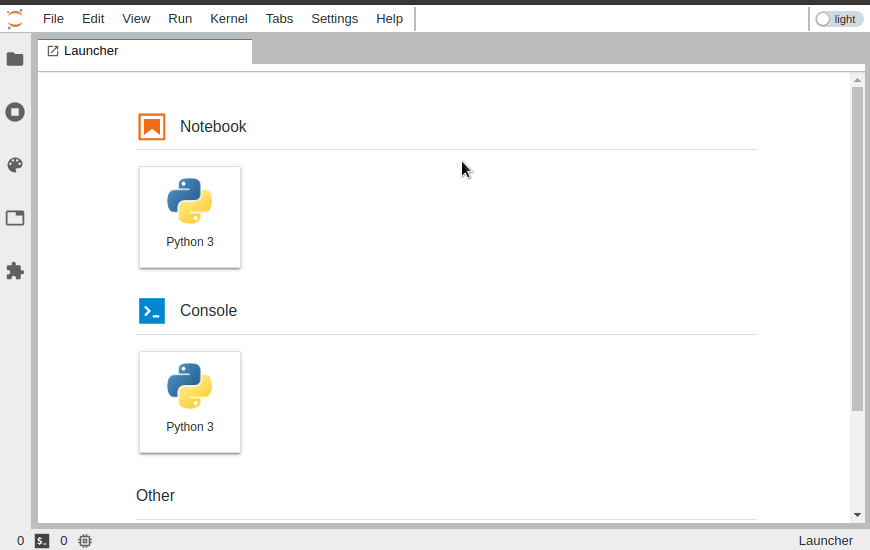

# jupyterlab-theme-toggle

JupyterLab extension to toggle the theme in the Top Bar area.



This extension was originally developed as part of the [jupyterlab-topbar](https://github.com/jtpio/jupyterlab-topbar) project, extracted into its own repository later on and
brought back into [jupyterlab-topbar](https://github.com/jtpio/jupyterlab-topbar) project.

## Prerequisites

- JupyterLab 1.0+

## Installation

### JupyterLab 4.x

Starting from JupyterLab 4.0, extension can be distributed as a Python package.
Use version `1.0.0` as other versions are incompatible with JupyterLab 4

```bash
pip install jupyterlab-theme-toggler==1.0.0
```

### JupyterLab 2.x and 3.x

This extension requires the `jupyterlab-topbar-extension` extension for JupyterLab to display the visual switch:

```bash
jupyter labextension install jupyterlab-topbar-extension jupyterlab-theme-toggle
```

To only install the keyboard shortcut (`Cmd/Ctrl+y` by default):

```bash
jupyter labextension install jupyterlab-theme-toggle
```

## Development

### JupyterLab 4.x

Note: You will need NodeJS to build the extension package.

The `jlpm` command is JupyterLab's pinned version of
[yarn](https://yarnpkg.com/) that is installed with JupyterLab. You may use
`yarn` or `npm` in lieu of `jlpm` below.

```bash
# Clone the repo to your local environment
# Change directory to the jupyterlab-logout directory
# Install package in development mode
pip install -e .
# Link your development version of the extension with JupyterLab
jupyter labextension develop . --overwrite
# Rebuild extension Typescript source after making changes
jlpm run build
```

You can watch the source directory and run JupyterLab at the same time in different terminals to watch for changes in the extension's source and automatically rebuild the extension.

```bash
# Watch the source directory in one terminal, automatically rebuilding when needed
jlpm run watch
# Run JupyterLab in another terminal
jupyter lab
```

With the watch command running, every saved change will immediately be built locally and available in your running JupyterLab. Refresh JupyterLab to load the change in your browser (you may need to wait several seconds for the extension to be rebuilt).

By default, the `jlpm run build` command generates the source maps for this extension to make it easier to debug using the browser dev tools. To also generate source maps for the JupyterLab core extensions, you can run the following command:

```bash
jupyter lab build --minimize=False
```

### JupyterLab 3.x

```bash
# create a new conda environment
conda create -n jupyterlab-theme-toggle jupyterlab nodejs
conda activate jupyterlab-theme-toggle

# required to place indicators in the top area
jupyter labextension install jupyterlab-topbar-extension

# install dependencies
jlpm

# local install of the extension
jupyter labextension install .
```

To rebuild the package and the JupyterLab app:

```bash
jlpm run build
jupyter lab build
```
